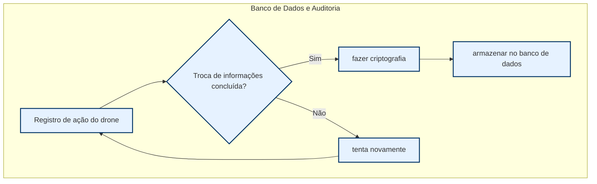
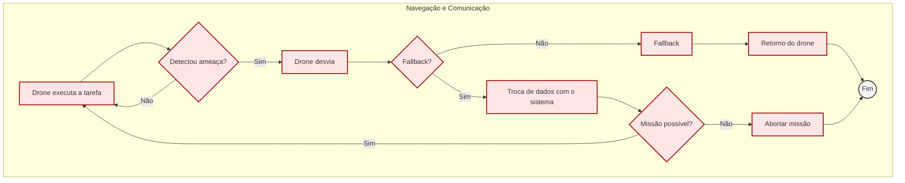
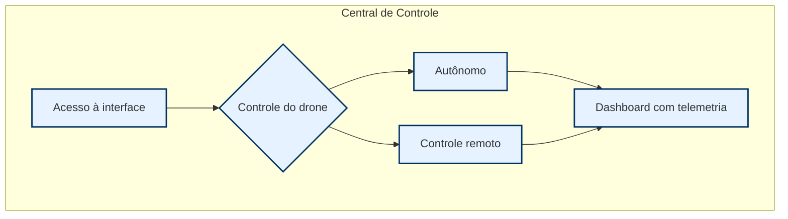
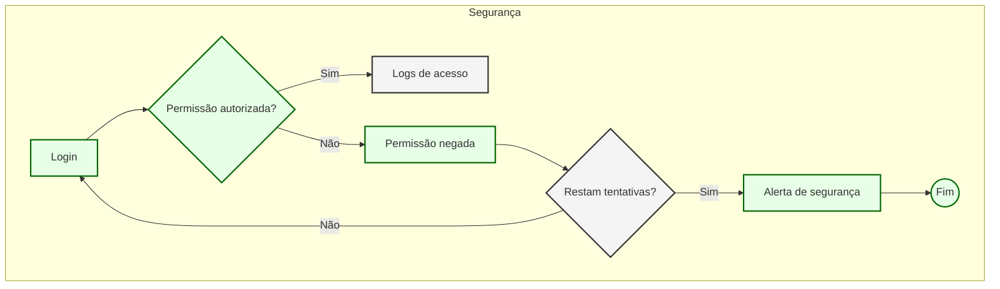
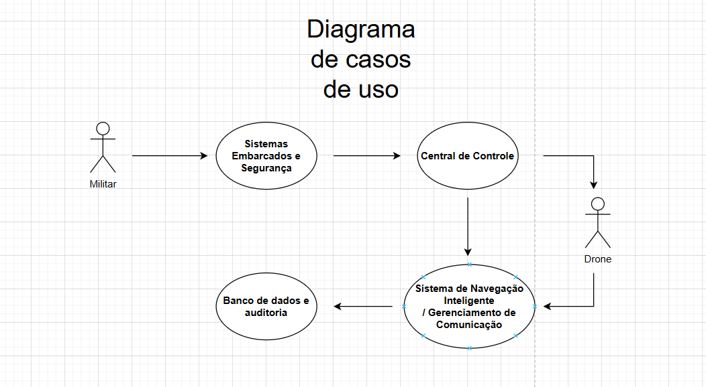

<h2><a href= "https://www.mackenzie.br">Universidade Presbiteriana Mackenzie</a></h2>
<h3><a href= "https://www.mackenzie.br/graduacao/sao-paulo-higienopolis/sistemas-de-informacao">Sistemas de Informação</a></h3>


<font size="+12"><center>
*&lt;Sistema Falcão Sombrio para Drones&gt;*
</center></font>

>*Observação 1: A estrutura inicial deste documento é só um exemplo. O seu grupo deverá alterar esta estrutura de acordo com o que está sendo solicitado na disciplina.*

>*Observação 2: O índice abaixo não precisa ser editado se você utilizar o Visual Studio Code com a extensão **Markdown All in One**. Essa extensão atualiza o índice automaticamente quando o arquivo é salvo.*

**Conteúdo**

- [Autores](#nome-alunos)
- [Descrição do Projeto](#introdução-do-projeto)
- [Análise de Requisitos Funcionais e Não-Fucionais](#descrição-dos-requisitos)
- [Diagrama de Atividades](#diagrama-de-atividades) 
- [Diagrama de Casos de Uso](#diagrama-de-comportamento-atores)
- [Descrição dos Casos de Uso](#descrição-das-funcões)
- [Diagrama de Senquencia](#diagrama-de-ordem-interações)
- [Diagrama de Classes](#diagrama-orientado-objetos)
- [Diagrama de Estados](#diagrama-estrutura-componente)
- [Diagrama de Implantação](#diagrama-de-hardware-software)
- [Referências](#referências)


# Autores

* Alexandre Eiji Tomimura Carvalho
* João Pedro Pioltini de Oliveira
* Luiz Eduardo Bacha dos Santos
* Matheus Veiga Bacetic Joaquim

# Descrição do Projeto

O **Sistema Falcão Sombrio** é um projeto para a reformulação da arquitetura de software dos drones bélicos autônomos da **Securus Dynamics**, visando melhorar sua eficiência, segurança e operação remota.

O sistema enfrentará desafios em **sistemas operacionais** (concorrência, segurança e tempo real) e **banco de dados** (distribuição, replicação e auditoria), garantindo comunicação segura e controle inteligente da frota de drones.

A **Consultoria Cyber Bullet System (Turma 4G)** foi contratada para modelar o novo sistema utilizando UML, cobrindo requisitos, diagramas e documentação técnica, conforme um planejamento estruturado em fases.

---

# Análise de Requisitos Funcionais e Não-Funcionais

## **Requisitos Funcionais**

<table>
    <tr>
        <th>ID</th>
        <th>Referência</th>
        <th>Descrição</th>
    </tr>
    <tr>
        <td>1</td>
        <td><strong>Central de Controle</strong></td>
        <td></td>
    </tr>
    <tr>
        <td>1.1</td>
        <td>- Interface para gerenciamento de frotas de drones.</td>
        <td>Uma interface que permite gerenciar a frota de drones, proporcionando uma visualização e controle.</td>
    </tr>
    <tr>
        <td>1.2</td>
        <td>- Controle remoto e autônomo dos drones.</td>
        <td>Permite controlar os drones manualmente e de forma autônoma, oferecendo flexibilidade nas operações.</td>
    </tr>
    <tr>
        <td>1.3</td>
        <td>- Dashboard em tempo real com telemetria.</td>
        <td>Um painel que exibe dados de telemetria dos drones em tempo real, garantindo todas as informações importantes.</td>
    </tr>
    <tr>
        <td>2</td>
        <td><strong>Sistema de Navegação Inteligente</strong></td>
        <td></td>
    </tr>
    <tr>
        <td>2.1</td>
        <td>- Sensoriamento do ambiente via LIDAR, câmeras e GPS.</td>
        <td>Utiliza LIDAR, câmeras e GPS para coletar dados do ambiente e orientar os drones de maneira precisa.</td>
    </tr>
    <tr>
        <td>2.2</td>
        <td>- Detecção e evasão de ameaças em tempo real.</td>
        <td>Detecta ameaças e realiza manobras evasivas em tempo real para evitar colisões e outros perigos, mantendo a segurança dos drones.</td>
    </tr>
    <tr>
        <td>2.3</td>
        <td>- Operação autônoma baseada em redes neurais.</td>
        <td>Utiliza inteligência artificial baseada em redes neurais para operar os drones de forma autônoma.</td>
    </tr>
    <tr>
        <td>3</td>
        <td><strong>Gerenciamento de Comunicação</strong></td>
        <td></td>
    </tr>
    <tr>
        <td>3.1</td>
        <td>- Protocolos para comunicação segura e em tempo real com os drones.</td>
        <td>Protocolos que garantem comunicação segura e em tempo real entre os drones e a central de controle.</td>
    </tr>
    <tr>
        <td>3.2</td>
        <td>- Mecanismos de fallback para evitar perda de conexão.</td>
        <td>Estratégias para manter a comunicação estável e evitar a perda de conexão com a central.</td>
    </tr>
    <tr>
        <td>4</td>
        <td><strong>Banco de Dados e Auditoria</strong></td>
        <td></td>
    </tr>
    <tr>
        <td>4.1</td>
        <td>- Logs de missões realizadas e eventos críticos.</td>
        <td>Registro detalhado das missões e eventos críticos ocorridos durante a operação dos drones, para consulta e análise futura.</td>
    </tr>
    <tr>
        <td>4.2</td>
        <td>- Criptografia de ponta e assinaturas digitais.</td>
        <td>Utilização de criptografia avançada e assinaturas digitais para garantir que os dados sejam seguros e autênticos.</td>
    </tr>
    <tr>
        <td>4.3</td>
        <td>- Banco de dados NoSQL distribuído para dados em tempo real.</td>
        <td>Sistema de banco de dados distribuído que permite atualizações e acessos em tempo real, garantindo mais eficiência.</td>
    </tr>
    <tr>
        <td>5</td>
        <td><strong>Sistemas Embarcados e Segurança</strong></td>
        <td></td>
    </tr>
    <tr>
        <td>5.1</td>
        <td>- Autenticação de operadores via biometria e autenticação multifator.</td>
        <td>Autenticação dos operadores utilizando biometria e múltiplos fatores de segurança, para garantir que apenas pessoas autorizadas tenham acesso.</td>
    </tr>
    <tr>
        <td>5.2</td>
        <td>- Monitoramento de processos do SO embarcado para evitar falhas.</td>
        <td>Monitoramento dos processos do sistema operacional dos drones, para prever e evitar falhas, garantindo uma operação estável.</td>
    </tr>
</table>

---

## **Requisitos Não Funcionais**

<table>
    <tr>
        <th>ID</th>
        <th>Referência</th>
        <th>Descrição</th>
    </tr>
    <tr>
        <td>1</td>
        <td><strong>Arquitetura Deficiente</strong></td>
        <td></td>
    </tr>
    <tr>
        <td>1.1</td>
        <td>- O sistema deve ter baixa latência e não sofrer interrupções de comunicação durante missões críticas.</td>
        <td>O sistema deve garantir comunicação contínua e rápida durante missões críticas, evitando qualquer tipo de atraso ou interrupção.</td>
    </tr>
    <tr>
        <td>2</td>
        <td><strong>Problemas de Segurança</strong></td>
        <td></td>
    </tr>
    <tr>
        <td>2.1</td>
        <td>- Implementação de um modelo robusto de autenticação e criptografia para evitar invasões e tomada de controle não autorizada.</td>
        <td>Deve ser implementado um modelo de segurança robusto que inclui autenticação forte e criptografia para proteger contra acessos não autorizados.</td>
    </tr>
    <tr>
        <td>2.2</td>
        <td>- O armazenamento de logs de auditoria deve ser imutável e altamente disponível.</td>
        <td>Os logs de auditoria devem ser armazenados de forma que não possam ser alterados e devem estar disponíveis a qualquer momento para consulta.</td>
    </tr>
    <tr>
        <td>3</td>
        <td><strong>Gerenciamento de Banco de Dados</strong></td>
        <td></td>
    </tr>
    <tr>
        <td>3.1</td>
        <td>- O sistema deve garantir a integridade e a sincronização dos dados dos drones em tempo real.</td>
        <td>O sistema deve assegurar que os dados dos drones sejam precisos e sincronizados em tempo real para uma operação eficiente.</td>
    </tr>
    <tr>
        <td>3.2</td>
        <td>- O histórico de missões precisa ser armazenado para auditorias e análise preditiva.</td>
        <td>O histórico das missões dos drones deve ser registrado para fins de auditoria e para realizar análises preditivas.</td>
    </tr>
    <tr>
        <td>3.3</td>
        <td>- Banco de dados distribuído e replicado para garantir a continuidade da operação.</td>
        <td>Deve ser utilizado um banco de dados distribuído e replicado para assegurar a continuidade das operações mesmo em caso de falhas.</td>
    </tr>
    <tr>
        <td>4</td>
        <td><strong>Sistemas Operacionais e Concorrência</strong></td>
        <td></td>
    </tr>
    <tr>
        <td>4.1</td>
        <td>- Os drones operam em um sistema operacional embarcado que precisa gerenciar múltiplas threads de sensores, navegação e IA.</td>
        <td>O sistema operacional dos drones deve ser capaz de gerenciar várias threads simultâneas para sensores, navegação e inteligência artificial.</td>
    </tr>
    <tr>
        <td>4.2</td>
        <td>- O sistema deve ser capaz de priorizar processos conforme o status crítico da missão.</td>
        <td>O sistema deve ter a capacidade de priorizar processos dependendo da criticidade de cada missão, garantindo que tarefas essenciais tenham prioridade.</td>
    </tr>
</table>

# Diagrama de Atividades - Sistema Falcão Sombrio




*&lt;Diagrama para visualizar o comportamento dos atores&gt;*

# Diagrama de Casos de Uso



# Descrição dos Casos de Uso

<table border="1">
    <tr>
        <td colspan = "2">Sistema Falcão Sombrio</td>
    </tr>
    <tr>
        <td>Função</td>
        <td>Gerenciar a operação remota e autônoma de drones bélicos</td>
    </tr>
    <tr>
        <td>Descrição</td>
        <td>O sistema permite controle remoto e autônomo dos drones, incluindo navegação inteligente, auditoria e comunicação segura.</td>
    </tr>
    <tr>
        <td>Entrada</td>
        <td>Respostas dos drones (posição, status da missão, telemetria)</td>
    </tr>
    <tr>
        <td>Fonte</td>
        <td>Central de Controle</td>
    </tr>
    <tr>
        <td>Saídas</td>
        <td>Comandos para os drones</td>
    </tr>
    <tr>
        <td>Destino</td>
        <td>Drones em operação</td>
    </tr>
    <tr>
        <td>Ação</td>
        <td>Enviar comandos para os drones, processar dados de telemetria e ajustar estratégias em tempo real.</td>
    </tr>
    <tr>
        <td>Requer</td>
        <td>Conectividade segura e estável entre o servidor e os drones.</td>
    </tr>
    <tr>
        <td>Pré-Condição</td>
        <td>O sistema precisa estar autenticado e autorizado para enviar comandos.</td>
    </tr>
    <tr>
        <td>Pós-Condição</td>
        <td>Os drones ajustam suas trajetórias e operações conforme os comandos recebidos.</td>
    </tr>
    <tr>
        <td>Efeitos colaterais</td>
        <td>Possibilidade de falha em comunicação levando a quedas temporárias na operação.</td>
    </tr>
</table>

*&lt;Descrição do comportamento entre os atores/resquisitos&gt;*


<table border="1">
    <caption><em>Especificação do caso de uso OPERAR DRONE</em></caption>
    <tr>
        <td><strong>Nome do Caso de Uso</strong></td>
        <td>Operar Drone</td>
    </tr>
    <tr>
        <td><strong>Ator Principal</strong></td>
        <td>Militar</td>
    </tr>
    <tr>
        <td><strong>Atores Secundários</strong></td>
        <td>Drone</td></td>
    </tr>
    <tr>
        <td><strong>Resumo</strong></td>
        <td>Este caso de uso descreve as etapas para controlar remotamente um drone para reconhecimento ou ataque.</td>
    </tr>
    <tr>
        <td><strong>Pré-condições</strong></td>
        <td>Autentificação validada com sucesso</td>
    </tr>
    <tr>
        <td><strong>Pós-condições</strong></td>
        <td>O drone executa a missão e salva os logs</td>
    </tr>
</table>

<h3>FLUXO PRINCIPAL</h3>
<table border="1">
    <tr>
        <th>Ações do Ator</th>
        <th>Ações do Sistema</th>
    </tr>
    <tr>
        <td>1. Operador inicia sessão no sistema</td>
        <td>2. Sistema autentica o operador</td>
    </tr>
    <tr>
        <td>3. Operador seleciona um drone para controle</td>
        <td>4. Sistema estabelece conexão com o drone</td>
    </tr>
    <tr>
        <td>5. Operador insere comandos de voo</td>
        <td>6. Sistema transmite comandos para o drone</td>
    </tr>
    <tr>
        <td>7. Operador monitora telemetria e ajusta trajetória</td>
        <td>8. Sistema atualiza a posição do drone em tempo real</td>
    </tr>
</table>


# Diagrama de Sequência
```mermaid
sequenceDiagram
    participant Militar as Operador Militar
    participant SistemaSeguranca as Sistema de Segurança
    participant CentralControle as Central de Controle
    participant Drone
    participant Navegacao as Sistema de Navegação
    participant BancoDados as Banco de Dados

    %% Autenticação e Inicialização
    Militar->>SistemaSeguranca: Login (biometria + token)
    activate SistemaSeguranca
    SistemaSeguranca-->>Militar: Acesso autorizado
    deactivate SistemaSeguranca

    %% Planejamento da Missão
    Militar->>CentralControle: Definir missão (coordenadas, prioridades)
    activate CentralControle
    CentralControle->>BancoDados: Registrar missão
    activate BancoDados
    BancoDados-->>CentralControle: Confirmação
    deactivate BancoDados
    CentralControle-->>Militar: Missão validada

    %% Execução da Missão
    CentralControle->>Drone: Transmitir ordens 
    activate Drone
    Drone->>Navegacao: Iniciar navegação autônoma
    activate Navegacao

    %% Monitoramento em Tempo Real
    loop Durante a missão
        Drone->>Navegacao: Enviar telemetria (GPS, sensores)
        Navegacao->>CentralControle: Atualizar dashboard
        CentralControle->>BancoDados: Armazenar logs
        activate BancoDados
        BancoDados-->>CentralControle: Confirmação
        deactivate BancoDados
    end

    %% Tratamento de Ameaças
    alt Detecção de ameaça
        Navegacao->>Drone: Alerta de colisão
        Drone->>Navegacao: Calcular rota alternativa
        Navegacao->>CentralControle: Notificar ameaça
        CentralControle->>Militar: Alerta prioritário
    else Sem ameaças
        Drone->>Navegacao: Continuar trajetória
    end

    %% Conclusão da Missão
    Drone->>CentralControle: Missão concluída
    CentralControle->>BancoDados: Sincronizar dados
    activate BancoDados
    BancoDados-->>CentralControle: Dados replicados
    deactivate BancoDados
    CentralControle-->>Militar: Relatório final

    deactivate CentralControle
    deactivate Drone
    deactivate Navegacao
````
# Diagrama de Classes

![Diagrama de Classes - Sistema Falcão Sombrio](https://www.plantuml.com/plantuml/png/VLVDRXkt4x_lKn2-HFddxwGjq1wCm8XYkua1st4YeVSnTxITXClP3hc2wpOFK_GGe42VmYzMVaWKDn9oi9US-SttnwvUEG_YnzuqxXFP0GHwfGquD_TUw6xqUAdPBkW1rNTDyqITuueiFNvv_9jLYmhjsBic_bSB3tvqvy8MrH-DKXTkG85mk2RdWCFX0teMov7NetHeDK7pkSdYInhuDLZDvtWEBRkauuONxw_2C_mlm1jQevbhT8uJPjxsPCbv2L8Ixky6t1v_8KSUhCSYV2liMRFXC-v7IneqP2tNxvVBy7YxNDuk8lg9EejPGAS6eU3e0EIQ9cL6xM9yjl21sobguwNEW4ldI3rZbXOjjE3Ut2wKOGs67gBXoBs6uMLMyd_rxkuZQd-gsXZ_0grZmQGYPr3rwJ7t8vX8fU0_9LqoUtgYrfozm7lKemV9GhFygFZ1honqjVDaDdMorcRN198giaI3FNeXAEO-Rr9IahwNbNAnt6EyrkMpktDalMOs25R1wD7wN9pNnCccXeWed1Jn1hzXiD33NjG5KpnTeApfMvxM5Ng3t0cielLItw9WL-8xC60rWfo1T50NOmLaU8rIqtgsv5a2cYtU0zVPh2PfukZSqphcwD92EfLmzaRcsTuWUHecwHKSJ4vkJTL2Wy_HvbHB3mzeDxMVfVzL489w752sxFSZok-1VQ2T4pgRpE0w5pkh4sRTMhcKtswiwih1QafHALXMK9NhYiBvvRJbJvKkzmGw1uzBwb6ruE4jIqhAOC3YnshUoXXEI2ko-tCfsCKj5UUkcuM_mrMlehtDnbf82_CYZdMkMUWRRKPAZBFOU2Q2IiAcgwt4UsZrdQfXIysBvcvmoiCzB0MiY_lcsqsYsQBsUzFOeYkSoJ0OSmVwKqrRer2SBxa2ZrRdtN9fFNOerT2IyzZ33QonAt4Tt9qkhKs27gtd1E8M3L_EbM2BDpWAcEoYJ_xDUmGDgUrocZ8XTQrDvcG-UhRS9vLuU5FkF9sFBVdeG9twKErJPRXpTIu3cYpuKS2TKqSUo4tQv68TGvZbnw6CfIm9jT3YxF2cwu9ogxCh1xVhzMWyhS2pr0CLj_BPLvLUWmcM92_hsNRTLsPhp-Obj1oPcUqeKq-Vg0zeG1FRN37NDFdzUNnygew-FzfE_udQlDRKwGJm_Fd_ZifA3oY7Ic_QEnw-GX_jDzA96XtimSg8P8IdCCqHbRqfi6qQ0cRx0cf13Im1MfpQWkkT70GwbDJl0Lfp2hmqKi1kTt7geI1Gx9QmIgbFIdq3GAsZ_fZbjnZOZr_WnIqRwbbMv7fk6hYBhQQzsdQCTTCtOtbvvFdAdoQx5hkwF9z_oFWQaCZLGe8U1VPXbprqsEzmuOpuQ3fZzMQEu8sNB_yyFiuEJ2ZPM4sAUcCERa6pnz1XGzX1mR8wEcFhXGqU9RFJBvb2o3MFXejSQPyYkB-ZfXAbeQOo5Na2B_MimOLOAAL79iANTYM0pileHwarb44fXBhpyZZUi0UdMWnp-Tj8ZZmxTHC_zdyURHfJSerbZqge-zKhNkMluKPL0YVXTXnqqpqe0_xndzZdaLRYpRyVN0f8pUAtzulqvVqqeMw5qYoLNnc3SDexJcbv_DUJ3jwYRLLqf9cwCmrfpwjm7qnn05LBBltCeKH8Y7hpgVd5ulY77tzAZAiuVDIF_l6lDLBbmQjm6dlp7m00 )
# Diagrama de Estados

*&lt;Diagrama para permite modelar o comportamento interno de um determinado objeto, subsistema ou sistema global&gt;*

# Diagrama de Implantação

*&lt;Diagrama para exibir o relacionamento de hardware e software no projeto&gt;*

# Referências

*&lt;Lista de referências&gt;*
